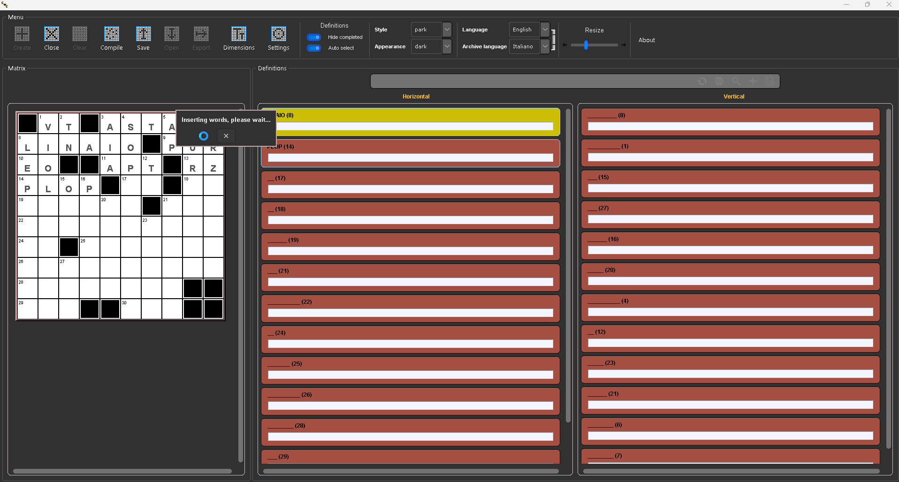
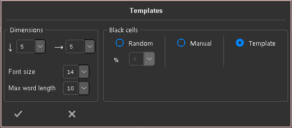
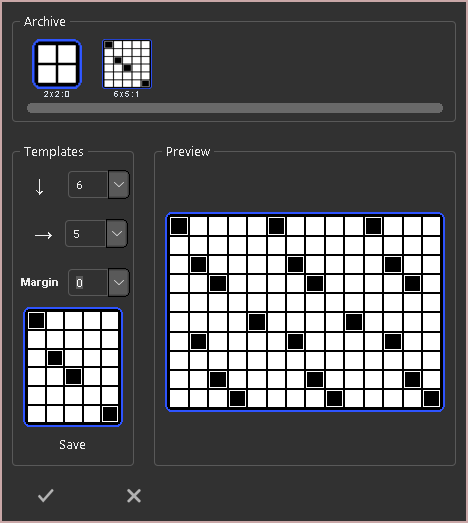
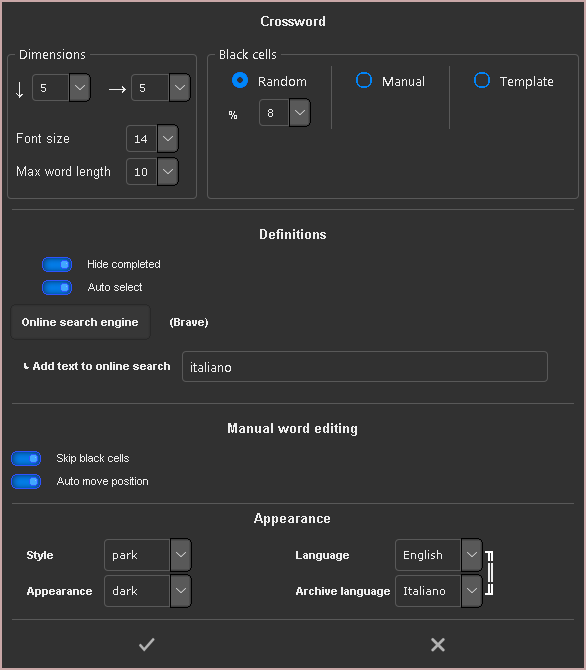
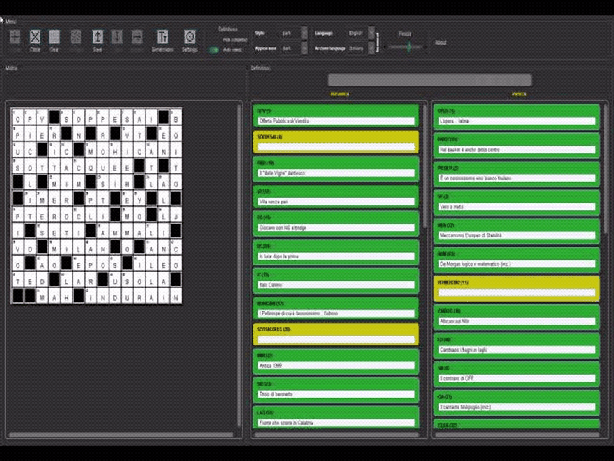

## What this is

This is a `CrossWord Creator`: application to create and export crosswords that are programmatically filled searching words
and definitions in a local database.


*splash screen*


## Project

A crossword is a project and projects can be saved and loaded.
The extension of the project file is `.cwc` that is a zipped directory.
Almost all settings are saved within the project to make it easier to "continue" when loaded.

## Worflow

- Create a crossword or open a project
- Eventually modify the white/black cells (if not yet finalized)
- Click on "Finalyze"
- Edit/auto fill the crossword
- If needed, edit/add the words and definitions
- If complete, export the crossword

> NOTE: single white cells surrounded by black cells and/or borders are invalid and marked as red.
> The crossword cannot be finalized if it contains red cells.


*autofilling crossword*


## Features

- words can be added and removed
- definitions can be added, removed, modified and searched locally and in the web
- crosswords can be manually edited and programmatically filled
- crosswords can be exported, actually only in pdf but plugins can be easily added to extend the formats
- the language of the application and of the database can be changed in run time
- the application has 2 modes (`light` and `dark`) and 3 styles (thanks to TKinterModernThemes - RobertJN64):
  - `azure`
  - `sun-valley`
  - `park`
- black cells can be generated in 3 ways:
  - random: giving a % and a `max word length`
  - manually: clicking on the cells
  - template: defining a pattern and a margin. Templates can be saved


*create panel*


*templates panel*

## Languages

`CWC` is multilanguage.
Actually Italian and English are supported but a new language can be added extending the file
`cwc_globals.__TRANSLATIONS_FILENAME`

```json
{
    "word" : [
        {"it" : "Parola"},
        {"en" : "Word"},
        {"add here the new ISO_639-1 language code" : "add here the new translation"}
```

Adding a new words/definitions language database is a bit more complex, especially finding the definitions :)
I suggest to copy/paste a present db in a new `ISO_639-1` language code directory, clear the db, reset the sequences
and fill it.
I thought to implement an utility inside the application to add a new language db but there's no standard format for the words
and, especially the definitions (if available somewhere).


*settings panel*

## Highlighintg and editing

The words in the crossword (in the left panel) and the definitions (in the right panel) are mutually highlighted.
If the mouse hovers the first cell of a word, it's relative definition is highlighted and viceversa.
In case of a cell that is the start of 2 words (horizontal and vertical), hovering on the left part of the cell
highlights the horizontal definition, on right part the vertical one.
Clicking on the upper part of a cell with a number (means the start of a word), navigates and opens it's definition.
Again, in case of 2 words, left is horizontal and right is vertical.
Clicking on a cell makes it selected (orange) and a letter can be inserted typing it.
Clicking on a cell that starts a word, will trigger (if enabled) an automatic moving by words: typing a letter will insert the
letter and move to the next char of the word, according to current direction. When a word is complete, it's definition will be
searched and the next word will be ready to be edited and it's first letter selected.


   

## Definitions

Once a word has been added to the crossword, the relative definition panel can be:

- red: the word was not found in the db
- yellow: the word was found in the db but not the definitions (or a definition has not been automatically selected)
- green: the word is complete, means found and a definition selected
  Once all the words are complete, the crossword can be exported
  Clicking on a definition panel, a panel is activated and the following actions might be executed, depending on the defintion state:
- Reload the definitions from the db (if the word was found)
- Search the current word in the web (the search engine can be defined in the Settings panel)
- Search locally in the db (there are some type of searches like `anagrams`, `starts_with`, etc
- Add the word to the db (if the word was not found)
- Add definitions (if the word was found). One can add definitions to the word using a panel
  If enabled, a random definition will be automatically selected when the defintions are found.
  If enabled, a definition panel that has a selected definition will be hidden.


*definitions search example*

## Exporter Plugins

To add an exporter plugin, one has to add:

- a file `<type>_exporter.py` (type is lowercase) in `GlobalData.PLUGINS_DIR`
- in that file, a class `<type>Exporter` (type is capitalized)
- in that class, a public method `def export(self, filename)` has to be implemented

## Notes

Tested **only** on Windows 11
A `create_exe.bat` will create a `cwc.exe` in the `<root>/dist/cwc` directory

## Contributing

You are welcome to contribute to the project or just to use it. In that case, a support would be nice :)

## Acknowledgements

`CWC` is based on:

- [TKinterModernThemes](https://github.com/RobertJN64/TKinterModernThemes) (c) RobertJN64, MIT License
- [CustomTkinter](https://github.com/TomSchimansky/CustomTkinter) (c) Tom Schimansky, MIT License
- [tkinter-tooltip](https://github.com/gnikit/tkinter-tooltip) (c) gnikit, MIT License

## Issues

- If the project `.cwc` file is renamed, the loading fails (it seems that fixed paths are stored in the zip archive).
- In case of very large crosswords and long words, the auto filling might never end.
- The `del_exclude_word_always` is still not implemented (exclude always the selected word - best way would be to add a bool column "excluded" in the word table).
- Still an installer is missing.
- ToolTips need to be added
- The english db does not have many definitions as the italian one
- The english definitions need to be cut, they come from a sort of encyclopedia.
- It's not fully and intensively tested so other bugs _might_ be present.

## License

MIT License
